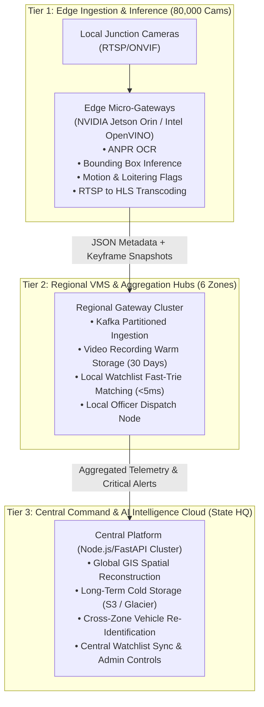

# Enterprise Scalability & System Architecture
## okDriver CCTV Monitoring & AI Video Analytics Platform
**Target Scale:** Prototype: 48 Cameras | Production Deployment: **80,000+ Distributed Heterogeneous Cameras**
**Aligned with:** Gujarat Police Innovation Hackathon 2026 Reference Problem Statement

---

## 1. Multi-Tier Distributed Processing Architecture

Scaling to 80,000 cameras requires a **3-Tier Compute Model** (Edge → Regional VMS Hubs → Central State Surveillance Cloud):

---

## 2. Video Bandwidth & Low-Bandwidth Optimization Strategy

Streaming 80,000 full raw 1080p RTSP video feeds to the cloud would require over **280 Gbps** of sustained bandwidth. Our architecture solves this via:

1. **Metadata-First Ingestion**:
   - Edge devices do **not** stream 24/7 video to the central cloud.
   - Only lightweight JSON telemetry (plate, timestamp, GPS, confidence, bounding box) is streamed continuously (~2 KB/sec per camera = only ~160 MB/sec for all 80,000 cameras).
2. **On-Demand Video Retrieval (WebRTC / HLS Relay)**:
   - Live video stream is only fetched and transcoded when an operator clicks "Live View" or when a High-Priority Watchlist Alert is triggered.
3. **Dynamic Resolution & Frame-Rate Throttling**:
   - Non-critical background cameras stream at 5 FPS / 720p.
   - When motion or vehicle presence is flagged, frame rate ramps automatically to 30 FPS / 1080p.

---

## 3. Database Indexing & Scalability Strategy

- **Relational Metadata (PostgreSQL / RDS Aurora)**:
  - User profiles, role permissions, camera registry, watchlist entries, and alert incident audit logs.
  - Indexed by `(camera_id, timestamp)` and `(identifier, active)`.
- **Time-Series Telemetry (TimescaleDB / ClickHouse)**:
  - Vehicle movement detections partitioned by `day` and `zone_id`.
  - Capable of indexing 100,000+ ANPR detections per second with sub-second vehicle route queries.
- **In-Memory Caching (Redis Cluster)**:
  - Watchlist fast lookup with in-memory Trie and Hash Sets (`O(1)` match complexity).
  - Active WebSocket session routing and pub/sub distribution across multi-core nodes.

---

## 4. Hardware & GPU Accelerator Requirements

| Component | Specification per 1,000 Cameras | Total for 80,000 Cameras |
| :--- | :--- | :--- |
| **Edge Compute** | 50x NVIDIA Jetson Orin Nano (20 cams/unit) | 4,000 Edge Units |
| **Regional Aggregation** | 2x 32-Core Servers + 64GB RAM | 160 Regional Servers across 6 Zones |
| **Central Cloud Cluster** | Kubernetes Cluster (32 vCPU, 128GB RAM) | 8 Central Scaled Pods |
| **Central GPU Worker Pool** | 4x NVIDIA A10G / L4 GPUs (Secondary Inference) | 32 Cloud GPUs for Heavy Tactical Re-ID |

---

## 5. High Availability, Monitoring & Disaster Recovery (DR)

- **99.99% Availability**: Multi-AZ Kubernetes deployment with automated pod health checks and failover.
- **Disaster Recovery**: Cross-region active-passive database replication with RPO < 1 min, RTO < 5 min.
- **Observability**: Prometheus metrics exporter for camera stream dropouts, WebSocket connection health, and API latency + Grafana alerting dashboards.

---

## 6. Cybersecurity & Network Segmentation

- **Zero-Trust Network Segmentation**: Edge cameras communicate only within isolated VLANs via encrypted mTLS.
- **Role-Based Access Control (RBAC)**: Fine-grained permissions (HQ Admin, Traffic Officer, RTO Inspector, CID Investigator).
- **Tamper-Resistant Audit Trail**: Every user login, camera onboarding, and alert acknowledgement is signed with timestamp and immutable audit log entry.
