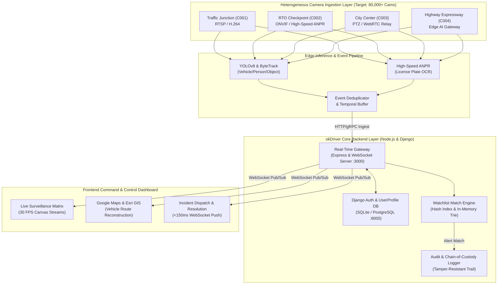
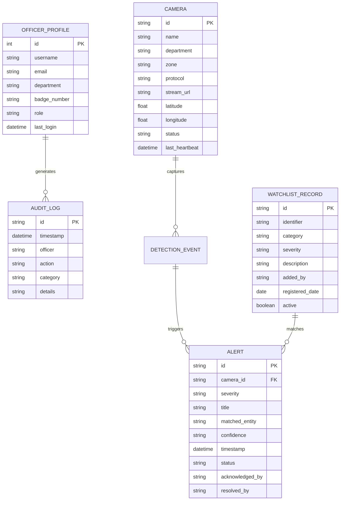

# okDriver Integrated CCTV Monitoring & AI Video Analytics Platform
> **Gujarat Police Innovation Hackathon 2026 Reference Solution**
> An enterprise-grade, edge-compatible surveillance intelligence layer unifying heterogeneous camera sources, AI event ingestion, real-time WebSocket synchronization, GIS spatial movement reconstruction, and tamper-resistant audit trails.

---

## 📑 System Architecture & Scale Overview



---

## 🚀 Key Implemented Deliverables

1. **Camera Registry & Onboarding**:
   - Manual onboarding modal (`+ Onboard Camera Source`) with lat/lon, protocol (RTSP/ONVIF/WebRTC/HLS), and zone.
   - Real-time search and multi-criteria filters (Department, Status, Keyword).
   - PTZ Camera Stream modal with Pan, Tilt, Zoom, and high-resolution Snapshot export.

2. **AI Video Analytics & Watchlist Alerting**:
   - Edge telemetry ingestion (`POST /api/analytics/events`) with bounding boxes, confidence, vehicle plates, and timestamps.
   - Live correlation against active watchlist (`Stolen Vehicles`, `Wanted Persons`, `Blacklisted`).
   - Automated instant alerts broadcast over WebSockets without page reload.
   - Alert management workflow (Acknowledge and Resolve with officer notes).

3. **GIS Spatial Intelligence & Movement Reconstruction**:
   - Interactive Leaflet GIS map with official Google Maps and Esri layers (no watermarks).
   - Multi-junction chronological vehicle route plotting (`GJ01XX0001` route from C001 → C002 → C004).
   - AI tactical intercept prediction with ETA and predicted interception points.

4. **Multi-Tenant User Management & Security**:
   - Role-based officer authentication (`Traffic Police`, `City Police`, `RTO`, `CID`).
   - User database managed through Django backend with SQLite/PostgreSQL support.
   - Dedicated authentication portal (`login.html`) and live sign-out flow.

5. **Chain-of-Custody Audit & CSV Export**:
   - System and operator audit logs (`GET /api/audit-logs`).
   - One-click official CSV download (`GET /api/reports/export-csv`).

---

## ⚙️ Quick Start Instructions

### Prerequisites
- Node.js (v18+)
- Python (3.10+)

### 1. Start Django Authentication Backend
```bash
cd okdriver_django
python manage.py migrate
python manage.py runserver 0.0.0.0:8000
```
*Django Admin Portal: [http://localhost:8000/admin/](http://localhost:8000/admin/) (admin/admin)*

### 2. Start okDriver Command Server
```bash
cd okdriver-cctv-platform
npm install
node server.js
```
*Frontend Command Dashboard: [http://localhost:3000](http://localhost:3000)*
*Login / Register Portal: [http://localhost:3000/login.html](http://localhost:3000/login.html)*

---

## 🗄️ Database Schema & Entity Relationship



---

## 📈 Scalability Toward 80,000 Cameras

For full enterprise scaling details across Edge Processing, Kafka Message Queuing, Redis Caching, Video HLS/WebRTC Relay, Bandwidth Optimization, and Cloud Sizing, see [ARCHITECTURE.md](file:///C:/Users/MCS/.gemini/antigravity/scratch/okdriver-cctv-platform/ARCHITECTURE.md).
