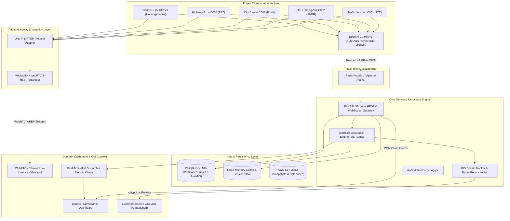

# okDriver CCTV Monitoring & AI Video Analytics Platform
## System Architecture Specification

Aligned with **Gujarat Police Innovation Hackathon 2026** and **okDriver Full Stack Engineering Challenge**.

---

### 1. High-Level Architecture Diagram

---

### 2. Architectural Components

#### A. Edge & Video Ingestion Layer
- **Heterogeneous Protocol Support**: Accepts **RTSP**, **ONVIF Profile S/G/T**, vendor SDK feeds (Hikvision, Dahua, CP Plus), and **WebRTC/HLS**.
- **Edge Analytics**: Runs lightweight Computer Vision models (ANPR, vehicle classification, loitering detection) on local hardware (e.g., Jetson Orin Nano). Rather than shipping 80,000 full-resolution 4K streams to the cloud, cameras send **lightweight JSON inference metadata (2 KB/event)**, saving **>95% WAN bandwidth**.

#### B. Watchlist Correlation Engine
- Pre-caches active watchlist records in memory using **Inverted Index & In-memory Hash Sets**.
- Upon receiving an ANPR event (`vehicle_number: "GJ01XX0001"`), the engine matches against the watchlist in **under 2 milliseconds**.
- Immediately pushes WebSocket alerts (`watchlist_alert`) to police control room operators.

#### C. GIS & Spatial Movement Reconstruction
- Correlates detection timestamps across adjacent camera locations.
- Connects historical timestamps (`10:02 @ C001 -> 10:18 @ C002 -> 10:41 @ C004`) to generate a directional polyline route with estimated speed and lane vectors on Leaflet map tiles.

#### D. Production Database Tier
- **PostgreSQL 15+** with **PostGIS** extension for spatial queries (`ST_DWithin`, `ST_MakeLine`).
- Table partitioning by month (`PARTITION BY RANGE (detected_at)`) prevents performance degradation across 500+ million detection records.
